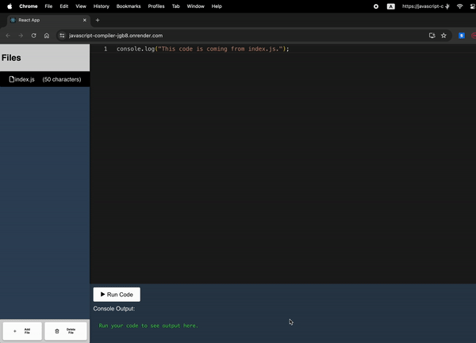

This project is an advanced online JavaScript compiler that allows users to write, edit, and execute JavaScript code in a web browser. It features a multi-file system, syntax highlighting, and real-time code execution with console output display.

## Features

- Multi-file support for complex projects
- Syntax highlighting powered by Monaco Editor
- Real-time code execution
- Console output capture and display
- File explorer for easy navigation between files
- Dockerized for easy deployment

## Tech Stack

- Frontend: React.js
- Backend: Node.js with Express
- Editor: Monaco Editor
- Virtualization: Docker

## Local Setup

To run this project locally, follow these steps:

1. Clone the repository:
   ```
   git clone https://github.com/adityavijay/javascript-compiler.git
   cd javascript-compiler
   ```

2. Set up the backend:
   ```
   cd backend
   npm install
   ```

3. Set up the frontend:
   ```
   cd ../frontend
   npm install
   ```

4. Start the backend server:
   ```
   cd ../backend
   npm start
   ```

5. In a new terminal, start the frontend development server:
   ```
   cd ../frontend
   npm start
   ```

6. Open your browser and navigate to `http://localhost:3000` to use the application.

## Running with Docker

If you prefer to use Docker, follow these steps:

1. Ensure Docker and Docker Compose are installed on your machine.

2. Navigate to the project root directory.

3. Build and start the containers:
   ```
   docker-compose up --build
   ```

4. Open your browser and navigate to `http://localhost` to use the application.

## Deployment

This project is set up for easy deployment on Render. Follow the deployment instructions in the project documentation for step-by-step guidance.

## Contributing

Contributions are welcome! Please feel free to submit a Pull Request.

## License

This project is licensed under the MIT License - see the LICENSE file for details.
